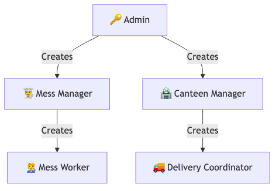
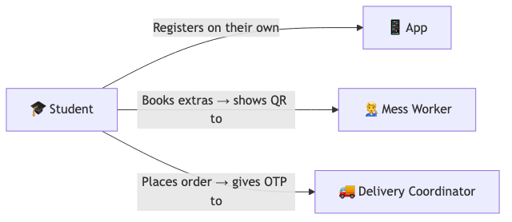

# UpsideDine Testing Guide

## 🔗 Important Links
| What | Link |
|------|------|
| **Download the App** | [Google Drive](https://drive.google.com/drive/folders/1Y38McMOE2u-_B7sHK87K8QH5YNkC8roX) |
| **GitHub Repo (Report Bugs Here)** | [karankk-05/upside-dine](https://github.com/karankk-05/upside-dine) |
| **Upload Success Screenshots Here** | [Google Drive](https://drive.google.com/drive/folders/1LzVdNRVc8YnMGRpAtYn2SGuxxpkSsrt0) |

---

## 📌 MUST READ: How the System Works
UpsideDine has different types of users. Think of it like a company — a boss hires managers, managers hire workers, and customers (students) walk in on their own.

1. **Admin** is at the top. Admin creates **Mess Managers** and **Canteen Managers**.
2. **Mess Managers** create **Mess Workers**. **Canteen Managers** create **Delivery Coordinators**.
3. **Students** register themselves (only students can self-register, all other accounts are created by someone above them).

### 📊 System Diagram

**Part A — Who Creates Whom (Management Chain):**

**Part B — How Students Interact:**

### How Login Works
- Open the app → You land on the **Auth Page** → Enter **Email** and **Password** → Hit **Sign In**.
- The app **automatically detects your role** from the backend and sends you to the right dashboard. No need to pick a role dropdown.
- Only **Students** can use the "Register" option. Everyone else's account is pre-created.

### How Student Registration Works
1. Tap **Register** on the auth page.
2. Fill in: **Full Name, Email, Phone, Roll Number, Hostel/Hall (dropdown), Room Number, Password, Confirm Password**.
3. An **OTP** is sent to your email. Enter the 6-digit OTP to verify and you're in.

---

## 🔐 Pre-Populated Accounts (USE THESE)
All accounts below are **already created** in the database. Use these credentials to log in.

### Admin
| Email | Password |
|-------|----------|
| `admin@iitk.ac.in` | `admin123` |

### Canteen 1: CCD
| Role | Email | Name | Password |
|------|-------|------|----------|
| Manager | `ccd_mgr@iitk.ac.in` | Rohan CCD | `canteen123` |
| Delivery Coordinator 1 | `ccd_del1@iitk.ac.in` | Rajesh Delivery | `delivery123` |
| Delivery Coordinator 2 | `ccd_del2@iitk.ac.in` | Suresh Delivery | `delivery123` |

### Canteen 2: Hall 7 Canteen
| Role | Email | Name | Password |
|------|-------|------|----------|
| Manager | `h7_mgr@iitk.ac.in` | Vikas H7 | `canteen123` |
| Delivery Coordinator 1 | `h7_del1@iitk.ac.in` | Amit Delivery | `delivery123` |
| Delivery Coordinator 2 | `h7_del2@iitk.ac.in` | Sumit Delivery | `delivery123` |

### Campus Mess 1: Hall 1
| Role | Email | Name | Password |
|------|-------|------|----------|
| Mess Manager | `hall1_mgr@iitk.ac.in` | Nitin Hall1 | `mess123` |
| Worker 1 | `hall1_w1@iitk.ac.in` | Gaurav Worker | `worker123` |
| Worker 2 | `hall1_w2@iitk.ac.in` | Pawan Worker | `worker123` |
| Student 1 | `hall1_s1@iitk.ac.in` | Aditya Verma | `student123` |
| Student 2 | `hall1_s2@iitk.ac.in` | Kavya Singh | `student123` |

### Campus Mess 2: Hall 5
| Role | Email | Name | Password |
|------|-------|------|----------|
| Mess Manager | `hall5_mgr@iitk.ac.in` | Dinesh Hall5 | `mess123` |
| Worker 1 | `hall5_w1@iitk.ac.in` | Sameer Worker | `worker123` |
| Worker 2 | `hall5_w2@iitk.ac.in` | Tarun Worker | `worker123` |
| Student 1 | `hall5_s1@iitk.ac.in` | Aryan Gupta | `student123` |
| Student 2 | `hall5_s2@iitk.ac.in` | Isha Patel | `student123` |

---

## 📸 Rules for Screenshots
Take screenshots at **every step** (form submissions, orders, scans, dashboard views, etc.).

* **✅ If it Works (Success):** Upload to the [Success Screenshots Drive](https://drive.google.com/drive/folders/1LzVdNRVc8YnMGRpAtYn2SGuxxpkSsrt0). **Create a folder with YOUR NAME** inside the drive to keep it organized.
* **❌ If it Fails (Bug/Crash/Unexpected Behavior):** Create a new Issue on [GitHub Issues](https://github.com/karankk-05/upside-dine/issues).
    * **Title format:** `[Bug] Short description - Your Name` (e.g., `[Bug] Login screen crashes on submit - Vivek`)
    * **Must include in the issue:**
      1. Your **name**.
      2. Screenshot(s) of the error.
      3. Exact **steps to reproduce** (what you clicked, what you typed).
      4. What **account/role** you were using.

---

## 👨‍💻 Testing Assignments (Step-by-Step)

Testing is divided among **Divyansh, Kaushal, Rohan, Dheeraj, Vivek, and Hanny**.
Coordinate with each other during cross-role flows (e.g., student placing order ↔ delivery coordinator fulfilling it).

---

### 1. Divyansh — Admin Dashboard
**Login:** `admin@iitk.ac.in` / `admin123`
**Where you land after login:** `/admin/managers` — the **Admin Manager Dashboard**

Your dashboard has **4 tabs across the top**: Overview, Manage Managers, Manage Messes, Manage Canteens.

| # | Tab | What to Do | Screenshot? |
|---|-----|-----------|-------------|
| 1 | — | Log in with the admin credentials. Confirm you land on the Admin Manager Dashboard. | ✅ |
| 2 | Overview | Click the **Overview** tab. Confirm it shows the welcome text "Manage canteen and mess managers from here." | ✅ |
| 3 | Manage Managers | Click the **Manage Managers** tab. Check that the existing managers (CCD, Hall7, Hall1, Hall5 managers) appear in the list with their names, emails, roles, employee codes, and Active/Frozen status. | ✅ |
| 4 | Manage Managers | Click the **"+ Add Manager"** button. Fill in the form: pick a name, email, phone, select role as **Mess Manager**, select a mess from the dropdown, and click **Create Manager**. Confirm you see the success message with email + employee code. | ✅ |
| 5 | Manage Managers | Do the same but select **Canteen Manager** as the role. You should see a different dropdown appear (Select Canteen/Outlet). Create the canteen manager. | ✅ |
| 6 | Manage Managers | On any existing manager, click the **Freeze** button. Confirm the status changes to "Frozen". Click **Activate** to bring them back. | ✅ |
| 7 | Manage Messes | Click the **Manage Messes** tab. Confirm existing messes (Hall 1, Hall 5) show up in the table with their names, halls, and status. | ✅ |
| 8 | Manage Messes | Click **"+ Add Mess"**. Type a hall name (e.g., "Hall 99") and click **Create Mess**. Confirm it appears in the table. | ✅ |
| 9 | Manage Messes | Click **Freeze** on the mess you just created. Confirm it changes to "Inactive". Click **Activate** to bring it back. | ✅ |
| 10 | Manage Messes | Click **Delete** on the fake mess you created. Confirm the confirmation popup appears and the mess disappears after confirming. | ✅ |
| 11 | Manage Canteens | Click the **Manage Canteens** tab. Confirm existing canteens (CCD, Hall 7 Canteen) show up. | ✅ |
| 12 | Manage Canteens | Click **"+ Add Canteen"**. Fill Name and Location, click create. Confirm it appears. | ✅ |
| 13 | Manage Canteens | **Freeze** → **Activate** the canteen you just created. | ✅ |
| 14 | Manage Canteens | **Delete** the fake canteen. | ✅ |

---

### 2. Kaushal — Mess Manager (Hall 1)
**Login:** `hall1_mgr@iitk.ac.in` / `mess123`
**Where you land after login:** `/manager/mess` — the **Mess Manager Dashboard**

Your dashboard has a **sidebar (or bottom bar on mobile)** with 3 tabs: Manage Mess, Manage Workers, Profile.

| # | Tab / Page | What to Do | Screenshot? |
|---|------------|-----------|-------------|
| 1 | — | Log in with the credentials above. Confirm you land on the Mess Manager Dashboard and see "Mess Manager" title. | ✅ |
| 2 | Manage Mess | You should see 3 cards: "Weekly Extras Menu", "Today's Bookings", and "Crowd Monitoring". Screenshot the cards. | ✅ |
| 3 | Manage Mess → Weekly Extras Menu | Click the **"Weekly Extras Menu"** card (navigates to `/manager/mess/menu`). Add a food item for the week. Try editing and deleting an item. | ✅ |
| 4 | Manage Mess → Today's Bookings | Go back and click **"Today's Bookings"** card (navigates to `/manager/mess/bookings`). Check if any student bookings show up (Dheeraj will be booking meals as part of his testing). | ✅ |
| 5 | Manage Mess → Crowd Monitoring | Click the **"Crowd Monitoring"** card (navigates to `/manager/crowd`). Try adding a camera video feed URL. Check if the ML feed renders. Try editing and deleting the feed. | ✅ |
| 6 | Manage Workers | Switch to the **Manage Workers** tab. Confirm existing workers (Gaurav Worker, Pawan Worker) appear with their emails, employee codes, and Active/Frozen badges. | ✅ |
| 7 | Manage Workers | Click **"+ Add Worker"**. Fill in Full Name, Email, Phone. Click **Create Worker**. Confirm the green success box shows with email and employee code. | ✅ |
| 8 | Manage Workers | Click the **toggle icon** (green/red) on a worker to Freeze them. Toggle again to Activate. | ✅ |
| 9 | Manage Workers | Click the **trash icon** on the test worker you just created to delete them. Confirm the confirmation popup and deletion. | ✅ |
| 10 | Profile | Switch to the **Profile** tab. Confirm it shows "Mess Manager Account" with your email and a Log Out button. | ✅ |

---

### 3. Vivek — Canteen Manager (CCD)
**Login:** `ccd_mgr@iitk.ac.in` / `canteen123`
**Where you land after login:** `/manager/canteen` — the **Canteen Manager Dashboard**

Your dashboard has a **sidebar (or bottom bar on mobile)** with 4 tabs: Manage Canteen, Delivery Staff, Payment Settings, Profile.

| # | Tab / Page | What to Do | Screenshot? |
|---|------------|-----------|-------------|
| 1 | — | Log in with the credentials above. Confirm you land on the Canteen Manager Dashboard and see "Canteen Manager" title. | ✅ |
| 2 | Manage Canteen | You should see 3 cards: "Manage Menu", "Active Orders", "Statistics". Screenshot the cards. | ✅ |
| 3 | Manage Canteen → Manage Menu | Click **"Manage Menu"** card (navigates to `/manager/canteen/menu`). Add a new food item (set name, price, mark as Veg or Non-Veg). Try editing price. Try toggling availability off/on. Try deleting an item. | ✅ |
| 4 | Manage Canteen → Active Orders | Click **"Active Orders"** card (navigates to `/manager/canteen/orders`). Check if any orders appear here (Rohan will be placing orders as part of his testing). Click on an order to see its detail page (`/manager/canteen/orders/:id`). | ✅ |
| 5 | Manage Canteen → Statistics | Click **"Statistics"** card (navigates to `/manager/canteen/stats`). Check if revenue and popular items data renders. | ✅ |
| 6 | Delivery Staff | Switch to the **Delivery Staff** tab. Confirm existing delivery personnel (Rajesh Delivery, Suresh Delivery) show up with emails, phone, employee code, and Active/Inactive status. | ✅ |
| 7 | Delivery Staff | Click **"+ Add Personnel"**. Fill Full Name, Email, Phone. Click **Create Delivery Person**. Confirm success message with email and employee code. | ✅ |
| 8 | Delivery Staff | Click the **toggle icon** to deactivate/activate a delivery person. Click the **trash icon** to delete the test one. | ✅ |
| 9 | Payment Settings | Switch to the **Payment Settings** tab. Enter a UPI ID (e.g., `ccd@upi`). Paste a QR code image URL (check if the preview renders). Select a payment mode (Online / Cash / Both). Click **Save Payment Settings** — confirm you see "✅ Saved!". | ✅ |
| 10 | Profile | Switch to **Profile** tab. Confirm it shows "Canteen Manager Account" with your email. | ✅ |

---

### 4. Hanny — Student Registration & Dashboard
**What to do first:** Register a brand new student account.
**Also test with:** `hall5_s1@iitk.ac.in` / `student123`

| # | Page | What to Do | Screenshot? |
|---|------|-----------|-------------|
| 1 | Auth Page | Open the app. You land on the login page. Click the **"Register"** link at the bottom to switch to signup mode. | ✅ |
| 2 | Signup | Fill in: **Full Name**, **Email** (use your real email so you get the OTP), **Phone**, **Roll Number**, select a **Hostel/Hall** from the dropdown, enter **Room Number**, set **Password** and **Confirm Password**. Click **Sign Up**. | ✅ |
| 3 | OTP Verification | You should now see the OTP screen saying "We've sent a 6-digit OTP to [your email]". Enter the OTP and click **Verify & Sign Up**. | ✅ |
| 4 | Student Dashboard | You should land on the dashboard. Check: Does it say "Hey, [Your Name]!" at the top? Does a search bar appear? | ✅ |
| 5 | Dashboard — Mess Section | Scroll down. You should see your assigned mess (based on your hostel) with two cards: **"Book Extras"** and **"Crowd Density"**. Screenshot this. | ✅ |
| 6 | Dashboard — Canteens | Below the mess section, you should see canteen cards in a 2-column grid. Check that **hall-based canteens** (e.g., "Hall 7 Canteen") are pushed to the **bottom** of the list while standalone ones (like CCD) appear at the top. | ✅ |
| 7 | Search | Type a canteen name in the search bar. Confirm the list filters to show only matching results. | ✅ |
| 8 | Crowd Density | Tap **"Crowd Density"** (goes to `/crowd/mess/:messId`). Check if the live crowd view renders. | ✅ |
| 9 | Profile | Tap the **"Profile" (👤)** icon in the bottom nav (goes to `/profile`). Confirm the Profile page shows "Student Account", a Dining Tab/MessAccountCard section, and a **Log Out** button. | ✅ |
| 10 | Pre-existing Login | Log out. Log in with `hall5_s1@iitk.ac.in` / `student123`. Confirm the dashboard loads correctly with data for a Hall 5 student. | ✅ |

---

### 5. Dheeraj — Mess Booking & Worker QR Verification (Full End-to-End)
**You will use TWO accounts:**
1. **Student account:** `hall1_s1@iitk.ac.in` / `student123` (to book a meal and get the QR)
2. **Worker account:** `hall1_w1@iitk.ac.in` / `worker123` (to scan the QR)

**Part A — Book a Meal as Student**

| # | Page | What to Do | Screenshot? |
|---|------|-----------|-------------|
| 1 | Auth | Log in with `hall1_s1@iitk.ac.in` / `student123`. Confirm you land on the Student Dashboard. | ✅ |
| 2 | Dashboard | You should see the mess section with **"Book Extras"** and **"Crowd Density"** cards. Tap **"Book Extras"** (goes to `/mess/:messId/menu`). | ✅ |
| 3 | Mess Menu | Browse the extras menu. Book an extra item. Confirm the booking is successful. | ✅ |
| 4 | My Bookings | Tap the **"Mess" (🍽️)** icon in the bottom nav (goes to `/mess/bookings`). Confirm your booking appears. Tap on it to view the **Booking Detail** page with the **QR code**. **Take a screenshot of the QR code** — you will need it next. | ✅ |
| 5 | — | **Log out** of the student account. | — |

**Part B — Verify as Mess Worker**

| # | Page | What to Do | Screenshot? |
|---|------|-----------|-------------|
| 6 | Auth | Log in with `hall1_w1@iitk.ac.in` / `worker123`. Confirm you land on the QR Scanner page. | ✅ |
| 7 | QR Scanner | The camera interface should open. If not on a phone, check if there's an image upload option. | ✅ |
| 8 | Scan Valid QR | Scan the QR code from your screenshot (use image upload or a second device). Confirm you see a **"Scan Successful"** message with the booking details. | ✅ |
| 9 | Double Scan | Try scanning the **same QR a second time**. The app should **block** it and show an error or "already redeemed" message. | ✅ |
| 10 | Invalid Scan | Try scanning a random QR code (not from the app) or entering a fake booking reference manually. Confirm the app shows an error gracefully (no crash). | ✅ |
| 11 | Scan History | Navigate to the **Scan History** page (`/worker/history`). Confirm it shows your recent successful and failed scans with timestamps. | ✅ |
| 12 | Worker Profile | Navigate to the **Worker Profile** page (`/worker/profile`). Confirm it shows your account info and scan stats. | ✅ |

---

### 6. Rohan — Canteen Order & Delivery (Full End-to-End)
**You will use TWO accounts:**
1. **Student account:** `hall1_s2@iitk.ac.in` / `student123` (to place a canteen order and get the OTP)
2. **Delivery account:** `ccd_del1@iitk.ac.in` / `delivery123` (to accept and complete the delivery)

**Part A — Place an Order as Student**

| # | Page | What to Do | Screenshot? |
|---|------|-----------|-------------|
| 1 | Auth | Log in with `hall1_s2@iitk.ac.in` / `student123`. Confirm you land on the Student Dashboard. | ✅ |
| 2 | Canteen | Tap on a **canteen card** (e.g., CCD) from the dashboard. Browse the menu on the canteen detail page (`/canteens/:id`). Add items to cart. | ✅ |
| 3 | Checkout | Proceed to **Checkout** (`/checkout`). Place the order. | ✅ |
| 4 | Order Detail | Tap the **"Orders" (📦)** icon in the bottom nav (goes to `/orders`). Confirm your order appears. Tap on it to see the **Order Detail** page (`/orders/:id`). **Note down the Delivery OTP** shown on screen. | ✅ |
| 5 | — | **Log out** of the student account. | — |

**Part B — Deliver as Coordinator**

| # | Tab / Section | What to Do | Screenshot? |
|---|--------------|-----------|-------------|
| 6 | Auth | Log in with `ccd_del1@iitk.ac.in` / `delivery123`. Confirm you land on the Delivery Dashboard showing "Deliveries" header. | ✅ |
| 7 | Home — Stats | At the top you should see 3 stat boxes: **DELIVERED** (count), **AVAILABLE** (count), **EARNINGS** (₹ amount). Screenshot these. | ✅ |
| 8 | Pending Deliveries | Look for the **"📦 Pending Deliveries"** section. Your order from Part A should appear here with order number, item names, canteen name, amount, and a **"🚴 Volunteer to Deliver"** button. | ✅ |
| 9 | Accept Order | Tap **"🚴 Volunteer to Deliver"**. Confirm it moves from "Pending" to your active deliveries list. You might first see it under **"⏳ Assigned – Waiting for Food"** if it's still being prepared. | ✅ |
| 10 | OTP Entry | Once the order shows under **"🚴 Active Deliveries"** with status "Out for Delivery", you should see a **6-digit OTP entry** section with 6 individual input boxes. Enter the OTP you noted from Part A. | ✅ |
| 11 | Confirm Delivery | Tap **"✅ Confirm Delivery"**. The order should move to the "Completed" section. The stats at the top should update. | ✅ |
| 12 | Wrong OTP | Place a second order as the student (repeat Part A). This time enter a **wrong OTP** on the delivery side. Confirm the app shows a red error message ("Invalid OTP") and does NOT complete the order. | ✅ |
| 13 | Completed Orders | Scroll down to the **"✅ Completed"** section. Confirm completed orders appear with order number, items, amount, and time. | ✅ |
| 14 | Profile Tab | Tap the **Profile (👤)** tab at the bottom. Confirm it shows your name, email, phone, role badge "Delivery Coordinator", and a **Performance** section with delivery count and order value. | ✅ |
| 15 | Logout | Tap the **Logout** button. Confirm you're taken back to the auth page. | ✅ |
